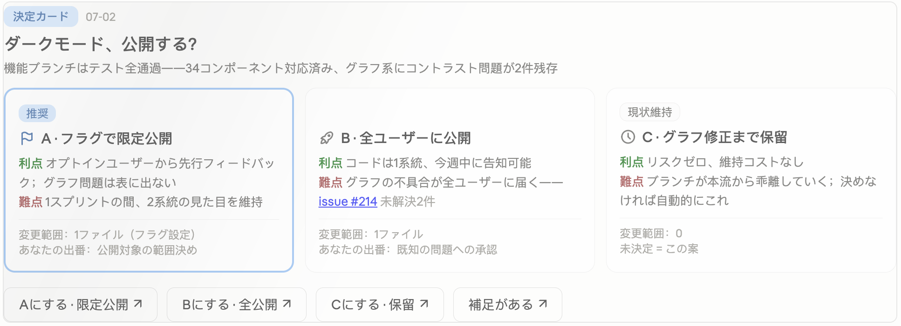
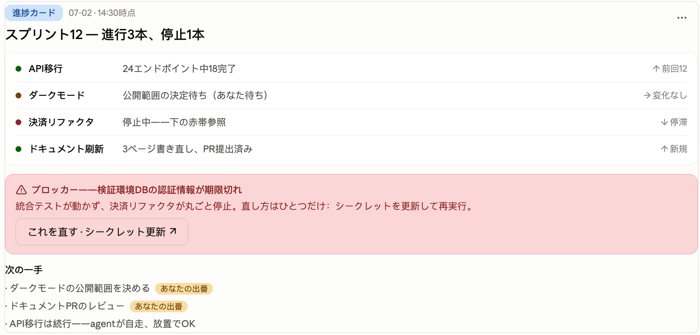
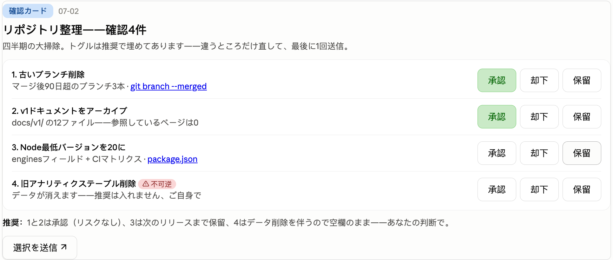

# Briefing Cards

[English](README.md) · [中文](README.zh-CN.md) · **日本語**

**エージェントの報告を、チャット内のインタラクティブなカードに変える Claude Code プラグイン。推奨を明示した選択肢、決定をそのまま送り返すボタン、ワンクリックで提出する承認リスト——そして「いつ描かないか」を決めるルーティングゲート付き。**



Claude Code のデスクトップアプリは、会話の中にライブ HTML ウィジェットを描画できます——ほとんどの人は、たまのグラフ表示でしか見かけません。本プラグインはこれを会話そのものに使います。エージェントが決定・進捗確認・一括承認を必要とするとき、文字の壁ではなくカードを描きます。カードのボタンが構造化された返信をチャットに送り返すので、「ユーザーが実際に承認したのはどの選択肢か」を推測する必要がなくなります。

## なぜ存在するのか

エージェントの報告には、2 つの慢性的な失敗モードがあります。

1. **不完全。** 散文はエージェントに、都合の悪い部分——トレードオフ、決めないことのコスト、自らの推奨——をこっそり省かせます。名前付きブロックを持つ固定テンプレートは、あらゆる欠落を可視化します。
2. **曖昧な締め。** 3 択のメッセージに「OK」と返すと、エージェントは違う方で走り出す。`意思決定カード「タイトル」(MM-DD):案A——…` をチャットに送り返すボタンは、この解釈の一手間を消します。

3 つ目の失敗モードもあります——修正が行きすぎて「何でもカード」になること。本プラグインの核は、**いつ描かないか**を判定する **T0–T3 ルーティングゲート**、そしてカードを稀に保つスロットル規則です。

## 中身

- **意思決定カード** — トレードオフ・変更範囲・根拠リンク・現状維持アンカー(「決めなければどうなるか」)・必須の推奨を備えた選択肢と、選択肢ごとに 1 つのボタン。
- **進捗カード** — 複数ワークストリームの表示専用ステータス。緑/黄/赤のドットと、強調表示されたブロッカー帯。許されるボタンは「ブロッカー対処」のみ、しかも対処が一意で明確なときだけ。
- **確認カード** — 承認/却下/保留のトグルを持つ項目の束。エージェントの推奨で事前入力され、1 つのメッセージにまとめて提出。不可逆な項目は決して事前入力しません。
- **T0–T3 ルーティング** — 段階的に上がる 4 つの形式:プレーンテキスト → Claude Code 標準の選択肢プロンプト(AskUserQuestion)→ チャット内カード → 独立した HTML ファイル。エージェントは低い段から始め、内容が単純な形式に本当に収まらないときだけ上げる——だからほとんどのターンはテキストのままです。
- **ウィジェットホストの癖に耐える実装ボイラープレート** — どの規則も、まず失敗にぶつかって学んだもの:inline `onclick` 禁止(ストリーミング中に壊れる)、ペイロードは `data-send` 属性へ、状態の見た目は JS で inline style として書く(`<style>` ブロックは黙って効かない)、プログラム的な `.click()` 禁止(信頼されないイベントは破棄される)、スクリプト読み込みまでコントロールは無効化、提出後は目に見えるロック。
- **受け取り側の規則** — 日付スタンプによる古いカードの検出(スクロールバックの古いボタンは永遠に生きている)、矛盾するコールバックの処理、不可逆なコールバックは実行前に復唱。

<p>


</p>

## 動作要件

- **Claude Code デスクトップアプリ** — チャット内ウィジェットツール(`mcp__visualize__show_widget` と `sendPrompt()` ブリッジ)を標準搭載。他に入れるものはありません——追加の MCP サーバーも設定も不要。
- 素のターミナル(CLI)ではカードは描画されず、プラグインは同じ内容を markdown テキストにフォールバックします。ターミナルのみのユーザーが得るのは、ボタンではなく報告の規律です。

> ⚠️ ウィジェット層はデスクトップアプリの非公開な内部機能で、予告なく変わる可能性があります。影響範囲は小さく、描画が壊れてもそのターンがテキスト報告になるだけ——セッションと設定は無傷です。2026 年 7 月時点で macOS デスクトップアプリで検証済み、Windows は未検証。

## インストール

Claude Code 内で(シェルではなく):

```
/plugin marketplace add vincent-wen789/claude-briefing-cards
/plugin install briefing-card@vincent-plugins
```

その後、**新しいセッションを開始**してください——自動トリガーはセッション開始時に注入されるため、インストールした当のセッションには反映されません。

## 動作確認

- **簡易チェック:** 新しいセッションで「T0–T3 の報告カードに関する常駐指示はありますか?」と尋ねます。ルーティングを復唱できれば、プラグインは有効です。
- **本チェック:** カードを求めずに、複数行の進捗報告やトレードオフのある 2 択を出させます。デスクトップアプリでは自動でカードを描くはず。ターミナルでは同じ内容がテキストで返ります(これは想定内のフォールバック、動作要件を参照)。

## なぜ skill ではなくプラグインなのか

skill の `description` が確実に発火するのは**明示的なトリガー**(ユーザーがカードを求めたとき)だけです。「決定や進捗を報告するときは既定でカードを描く」という**常時発動型の自動トリガー**は担えません。この挙動には毎ターン文脈に常駐する standing instruction が必要で、素の skill フォルダにはそれが同梱されない——だから新しいマシンでは「入れても入れていないのと同じ」に感じられます。

本プラグインは **SessionStart フック**でこれを解決します。セッション開始 / clear / compact のたびに、ルーティング規則を常駐コンテキストとして注入。skill(テンプレート + 完全なルーティング仕様)は、実際にカードを描くときにオンデマンドで読み込まれます。インストールするだけで動作し、`CLAUDE.md` を編集する必要はありません。

```
.claude-plugin/plugin.json        # プラグインのマニフェスト
.claude-plugin/marketplace.json   # マーケットプレイス登録(source: "./")
hooks/hooks.json                  # SessionStart → session-start を実行
hooks/session-start               # 常駐ルーティング文脈を注入するスクリプト
hooks/session-context.md          # ルーティング本体(トリガー挙動の変更はここ)
skills/briefing-card/SKILL.md     # カードのテンプレート + 完全な T0–T3 仕様
```

## コールバックのループ

すべてのボタンは `<カード種別>「タイトル」(MM-DD):` を接頭辞とするメッセージを送ります——カードなしでも独立して読めます。日付スタンプにより、エージェントはスクロールバックにある 1 週間前のカードをあなたが押したことを認識し、盲目的に再実行せず確認します。確認カードは提出時に、すべてのトグルを 1 つのメッセージにまとめます——クリックごとのチャット氾濫はありません。

ボタンのクリックは、あなたがそのメッセージを自分で打つのと完全に等価です。ペイロード全文がチャットに現れ、何も黙って送られず、ボタンを無視して返信を打ち込むこともいつでもできます。

## チューニング

ダイヤルは 2 つ、どちらも `hooks/session-context.md`(注入されるブロック)の中にあります。

- **トリガーの姿勢。** 本エディションは**既定でカードを出す**設定で出荷されています——報告 / 決定 / 承認のターンは、一文で済む場合を除いてカードを描きます。カードを稀にしたければ、保守的に反転させます:「テキストのままにし、内容が収まらないときだけ描く」。
- **スロットル。** 既定:1 時間以内に 2 枚まで、以降はテキスト。セッション内で未返信の意思決定カードが 3 枚以上 → 新しい決定はテキストへ。正直な注意:これらはエージェントが従うプロンプト級の規則であり、コードによる強制ではありません——カウントを検証可能にしているのは、トランスクリプト内の日付スタンプ付きカード接頭辞です。

## 注記

これは**個人版**です。語り口・トリガー語・「既定でカードを出す」傾向は特定ユーザー向けに調整されており、注入されるルーティングブロックは中国語で書かれています。誰でもインストールして問題なく動きますが、一般向けに配布するなら語り口を汎用化し、既定の姿勢を保守的に反転させる必要があります(チューニング参照)。さもないとカードを出しすぎます。

## ライセンス

[MIT](LICENSE)
