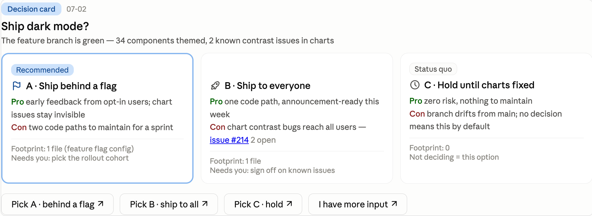
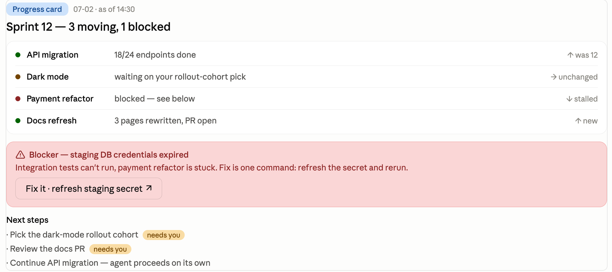
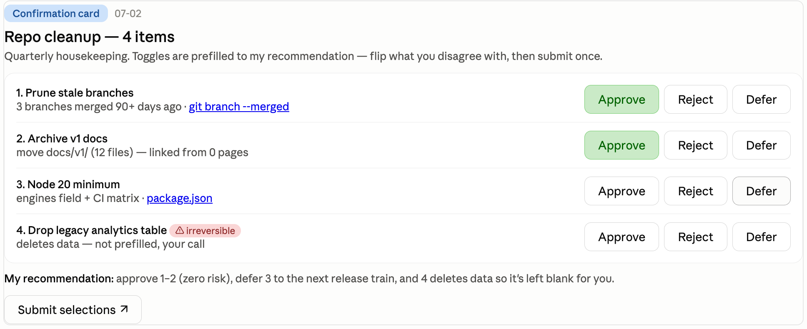

# Briefing Cards

**English** · [中文](README.zh-CN.md) · [日本語](README.ja.md)

**A Claude Code plugin that turns your agent's reports into interactive cards in the chat: options with a stated recommendation, buttons that send the decision straight back, sign-off lists that submit in one click — plus a routing gate that decides when *not* to draw one.**



Claude Code's desktop app can render live HTML widgets inside the conversation — most users only ever see it for the occasional chart. This plugin uses it for the conversation itself: when your agent needs a decision, a status read, or a batch sign-off, it draws a card instead of a wall of text. Because the card's buttons feed structured replies back into the chat, "which option did the user actually approve?" stops being a guessing game. **A button click is just you typing that reply yourself** — the full text lands in the chat, nothing is sent silently, and you can ignore the buttons and type instead any time.

> ℹ️ **Heads-up — this is a personal edition.** It installs and runs for anyone, but the always-on routing instructions are in Chinese, tuned to one user's taste, and lean toward *drawing cards eagerly* by default (a throttle keeps them rare). One edit flips the whole posture to conservative English — see [Tuning](#tuning).

## Why it exists

Agent reports have two chronic failure modes:

1. **Incomplete.** Prose lets the agent quietly skip the inconvenient parts — the trade-offs, the cost of not deciding, its own recommendation. A fixed template with named blocks makes them harder to skip silently.
2. **Ambiguous closure.** You reply "ok" to a three-option message and the agent runs with the wrong one. A button that sends `Decision card [Title] (MM-DD): Option A — …` back into the chat removes the interpretation step.

There's a third failure mode: the fix overshooting into cards-for-everything. The core of this plugin is a **T0–T3 routing gate** that decides when *not* to draw — plus a throttle rule that keeps cards rare.

## What's inside

- **Decision card** — options with trade-offs, change footprint, evidence links, a status-quo anchor ("what happens if you don't decide"), a mandatory recommendation, and one button per option.
- **Progress card** — display-only status across workstreams with green/yellow/red dots and a highlighted blocker bar. The only button allowed is "handle blocker", and only when the fix is unambiguous.
- **Confirmation card** — a batch of items with approve/reject/defer toggles, prefilled to the agent's recommendation, submitted as one merged message. Irreversible items are never prefilled.
- **T0–T3 routing** — four escalating forms: plain text → Claude Code's built-in option prompt (AskUserQuestion) → in-chat card → standalone HTML file. The agent starts low and escalates only when the content genuinely doesn't fit the simpler form — so most turns stay text.
- **Quirks it already handles for you** — every rule here was learned by hitting the failure first, so you don't have to: no inline `onclick` (breaks during streaming), payloads in `data-send` attributes, state visuals written by JS as inline styles (`<style>` blocks silently fail), no programmatic `.click()` (untrusted events get dropped), controls disabled until scripts load, visible lock after submit.
- **Receiving-end rules** — stale-card detection via date stamps (old buttons stay alive in scroll-back forever), contradictory-callback handling, restate-before-execute for irreversible callbacks.

<p>


</p>

## Requirements

- **Claude Code desktop app** — it ships with the in-chat widget tools built in (`mcp__visualize__show_widget` and the `sendPrompt()` bridge). Nothing else to install — no extra MCP server, no API key, no configuration. Never seen a widget or chart render in your chat? That surface is desktop-app-only — see the ⚠️ note just below.
- In a plain terminal (CLI) the cards don't render; the plugin falls back to the same report structured as markdown text. Terminal-only users get the reporting discipline, not the buttons.

> ⚠️ The widget surface is an undocumented internal feature of the desktop app and may change without notice. The blast radius is small: if rendering breaks you get a text report that turn — your session and config are unaffected. Verified on the macOS desktop app as of July 2026; Windows untested.

## Install

In Claude Code (not your shell):

```
/plugin marketplace add vincent-wen789/claude-briefing-cards
/plugin install briefing-card@vincent-plugins
```

Then **start a new session** — the auto-trigger is injected at session start, so it won't affect the session you installed from.

Uninstall anytime with `/plugin uninstall briefing-card@vincent-plugins` (or via the `/plugin` menu) — nothing else on your machine is touched.

## Verify

- **Quick:** in a new session, ask *"Do you have standing T0–T3 briefing-card instructions?"* If it recites the routing, the plugin is live.
- **Real:** without asking for a card, have it give you a multi-line progress report or two options with trade-offs. In the desktop app it should auto-draw a card; in a terminal you'll get the same report as text (that's the expected fallback, see Requirements).

## Why a plugin, not just a skill

A skill's `description` reliably fires only on *explicit* triggers — you asking for a card. It can't carry *ambient* auto-triggering: "draw a card whenever you're about to report a decision or progress." That needs a standing instruction resident in context every turn, which a bare skill folder doesn't ship — so on a fresh machine it feels like nothing installed.

This plugin fixes that with a **SessionStart hook** that injects the routing rules as resident context on every session start / clear / compact. It's a small block — ~1.3k tokens, added once at session start (and cached after), not re-sent per message. The skill (templates + full routing spec) still loads on demand only when a card is actually being drawn. Install and it just works — no editing your `CLAUDE.md`.

```
.claude-plugin/plugin.json        # plugin manifest
.claude-plugin/marketplace.json   # marketplace entry (source: "./")
hooks/hooks.json                  # SessionStart → run session-start
hooks/session-start               # injects the resident routing context
hooks/session-context.md          # the routing block (edit trigger behavior here)
skills/briefing-card/SKILL.md     # the card templates + full T0–T3 spec
```

## The callback loop

Every button sends a message prefixed `<Card type> [Title] (MM-DD):` — self-contained and readable without the card. The date stamp lets the agent recognize when you clicked a week-old card in your scroll-back, so it confirms instead of blindly re-executing. Confirmation cards merge all your toggles into a single message on submit — no per-click chat spam.

As noted up top, a button click is exactly equivalent to you typing that message yourself: the full payload appears in the chat, nothing is sent silently, and you can always ignore the buttons and type a reply instead.

## Tuning

Two dials, both in `hooks/session-context.md` (the injected block):

- **Trigger posture.** This edition ships *card-by-default* — report / decision / sign-off turns draw a card unless a single sentence covers it. To flip it: in `hooks/session-context.md`, swap that default for its inverse — *stay plain text; draw only when the content genuinely doesn't fit*. It's the one paragraph marked as the default posture.
- **Throttle.** Defaults: 2 cards within an hour, then text; 3+ unanswered decision cards in a session → new decisions go as text. Honest caveat: these are prompt-level rules the agent follows, not code enforcement — the date-stamped card prefixes in the transcript are what make the count checkable.

## Generalizing it

To adapt this personal edition for a broad audience (see the heads-up up top): translate the routing block (`hooks/session-context.md`) to English and flip the default posture to conservative (see Tuning) — otherwise it over-draws cards for anyone who isn't the author.

## License

[MIT](LICENSE)
