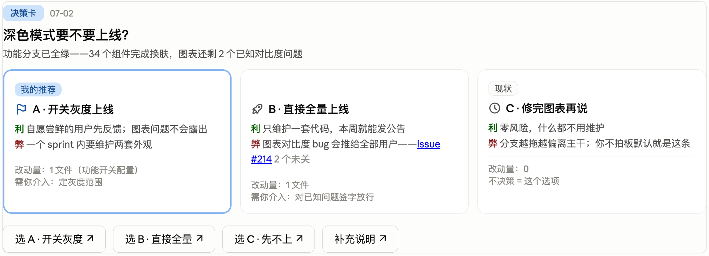
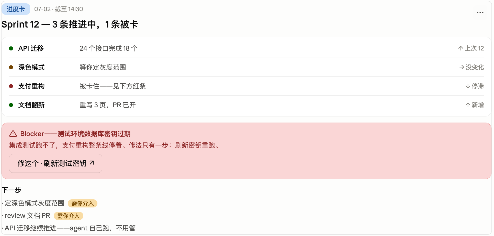
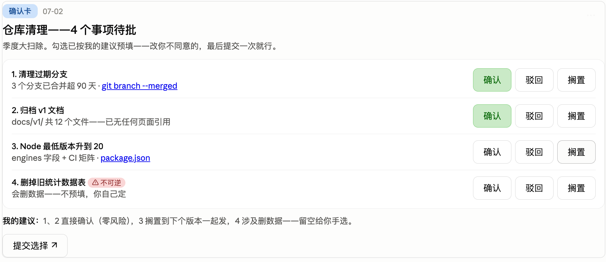

# Briefing Cards

[English](README.md) · **中文** · [日本語](README.ja.md)

**一个 Claude Code 插件:把 agent 的汇报变成聊天内的交互卡片——带明确倾向的选项、点一下就把决策回传的按钮、一次勾选提交的确认清单,外加一个决定「什么时候别画卡」的路由闸。**



Claude Code 桌面版能在对话里渲染实时 HTML 小组件——多数人只在偶尔看图表时见过它。本插件把这能力用在对话本身:当 agent 需要你拍板、看进度、或批量确认时,它画一张卡,而不是甩一墙文字。因为卡上的按钮会把结构化回复喂回聊天,「用户到底批的是哪个选项」不再靠猜。**点按钮 = 你自己打出那条消息**:完整文案出现在聊天里,没有任何东西被静默发送,你也随时可以无视按钮直接打字。

> ℹ️ **提醒:这是个人版。** 谁装都能跑,但常驻的路由指令是中文、按单个用户的口味调的,而且默认就偏向「积极画卡」(有节流规则兜底,不会刷屏)。一处编辑就能把整个姿态翻成保守的英文——见[调参](#调参)。

## 为什么要有它

Agent 的汇报有两个老毛病:

1. **不完整。** 纯文字让 agent 能悄悄跳过不方便的部分——取舍、不决策的代价、它自己的倾向。固定模板的具名区块让这些更难被悄悄跳过。
2. **收口含糊。** 你对一条三选项的消息回「ok」,agent 却跑错了那个。一个把 `决策卡「标题」(MM-DD):选方案 A——…` 回传进聊天的按钮,消灭了这层解读。

还有第三个毛病:修前两个时用力过猛,变成「什么都画卡」。本插件的核心是一道 **T0–T3 路由闸**,专门判断「什么时候别画」——再加一条节流规则,让卡保持稀有。

## 里面有什么

- **决策卡** — 选项带取舍、改动量、证据链接、现状锚(「不拍板会怎样」)、一条必填的倾向,每个选项一个按钮。
- **进度卡** — 纯展示的多线状态,绿/黄/红状态点 + 高亮 blocker 条。唯一允许的按钮是「处理 blocker」,且仅当处理动作唯一明确时。
- **确认卡** — 一批待确认项,确认/驳回/待定三态勾选,默认预填成 agent 的建议,合并成一条消息提交。不可逆项永不预填。
- **T0–T3 路由** — 四档逐级升级:纯文字 → Claude Code 内置选项提问(AskUserQuestion)→ 聊天内卡片 → 独立 HTML 文件。agent 从低档起,只有内容确实塞不进更简单的形式才升级——所以大多数回合停在文字。
- **已经替你处理好的宿主怪癖** — 每条规则都是先撞坑撞出来的,省得你再撞:禁 inline `onclick`(流式期间会断)、payload 进 `data-send` 属性、状态视觉用 JS 写 inline style(`<style>` 块会静默失效)、禁程序化 `.click()`(非可信事件会被丢弃)、控件加载完才点亮、提交后可见锁定。
- **接收端守则** — 靠日期戳识别旧卡(滚动区里旧按钮永远活着)、矛盾回传的处理、不可逆回传先复述再执行。

<p>


</p>

## 前置条件

- **Claude Code 桌面版** — 它自带聊天内 widget 工具(`mcp__visualize__show_widget` 和 `sendPrompt()` 桥)。别的都不用装——没有额外 MCP server,没有 API key,没有配置。从没在聊天里见过 widget 或图表渲染?这一层只有桌面版有——见紧接下面的 ⚠️ 那条。
- 纯终端(CLI)里卡片不渲染;插件会退回成同样内容的 markdown 文字版。只用终端的人拿到的是汇报纪律,不是按钮。

> ⚠️ widget 这一层是桌面版未公开的内部特性,可能随时变。爆炸半径很小:渲染坏了就是那一回合退回文字版——会话和配置都不受影响。截至 2026 年 7 月在 macOS 桌面版验证过;Windows 未测。

## 安装

在 Claude Code 里(不是终端 shell):

```
/plugin marketplace add vincent-wen789/claude-briefing-cards
/plugin install briefing-card@vincent-plugins
```

然后**新开一个会话**——自动触发在会话开始时注入,所以装它的那个会话不受影响。

随时卸载:`/plugin uninstall briefing-card@vincent-plugins`(或走 `/plugin` 菜单)——机器上别的东西都不动。

## 验证

- **快检:** 新会话里问一句「你现在有没有关于 T0–T3 汇报卡的常驻指令?」它能把路由复述出来 = 插件生效。
- **真检:** 别开口要卡,让它做个多线进度汇报、或给你俩带取舍的选项。桌面版里它应当自动出卡;终端里你会拿到同样内容的文字版(这是预期的退回,见前置条件)。

## 为什么是插件,而不只是 skill

skill 的 `description` 只对**显式触发**可靠——你开口要卡。它扛不住**弥漫式自动触发**——「要汇报决策/进度时默认就画卡」。这种行为需要一段每轮常驻在上下文里的 standing instruction,裸 skill 文件夹不带这段——所以在新机器上「装了跟没装一样」。

本插件用一个 **SessionStart hook** 解决:每次会话开始 / 清屏 / 压缩时,把路由规则作为常驻上下文注入。这是一小段——约 1.3k token,每次会话开始注入一次(之后走缓存),不是每条消息都重发。skill(模板 + 完整路由规格)仍只在真要画卡时按需加载。装上即用,不用改你的 `CLAUDE.md`。

```
.claude-plugin/plugin.json        # 插件清单
.claude-plugin/marketplace.json   # marketplace 条目(source: "./")
hooks/hooks.json                  # SessionStart → 跑 session-start
hooks/session-start               # 注入常驻路由上下文的脚本
hooks/session-context.md          # 路由块(要改触发行为改这里)
skills/briefing-card/SKILL.md     # 卡片模板 + 完整 T0–T3 规格
```

## 回传闭环

每个按钮发出的消息都带前缀 `<卡类>「标题」(MM-DD):`——脱离卡片也能独立读懂。日期戳让 agent 认出你点的是滚动区里一周前的旧卡,于是先确认而不是盲目重做。确认卡在提交时把你所有勾选合并成一条消息——不逐次刷屏。

如上文所说,点按钮和你自己打出那条消息完全等价:完整 payload 出现在聊天里,没有任何东西被静默发送,你也随时可以无视按钮直接打字回。

## 调参

两个旋钮,都在 `hooks/session-context.md`(被注入的那段)里:

- **触发倾向。** 本版出厂是**默认就出卡**——汇报 / 决策 / 确认场景默认画卡,除非一句话能说清。想翻:在 `hooks/session-context.md` 里把这个默认换成反过来的——「默认走文字,只有内容确实塞不进文字才画」。就是标着「默认姿态/翻转默认」的那一段。
- **节流。** 默认:1 小时内 2 张卡,之后转文字;一个 session 里 3 张以上没回传的决策卡 → 新决策走文字。诚实提醒:这些是 agent 遵守的 prompt 级规则,不是代码强制——transcript 里带日期戳的卡前缀,才是让计数可查的东西。

## 推广给别人

要把这个个人版改成适合大众的(见开头的提醒):把路由块(`hooks/session-context.md`)翻成英文、并把默认倾向翻成保守(见调参)——否则对作者以外的人它会过度画卡。

## 许可

[MIT](LICENSE)
